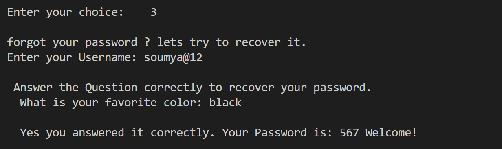
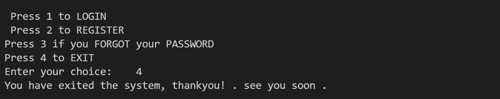

# 
 LOGIN AND REGISTRATION SYSTEM 

* This is a Login and Regisration System, implemented using c++.

* A User can Register or Login. They can recover their password by answering a question set during registration.

### 
Register

###

### 
Login

###

### 
ForgotPassword

###

### 
exited the system

###

### 
Invalid choice

###
